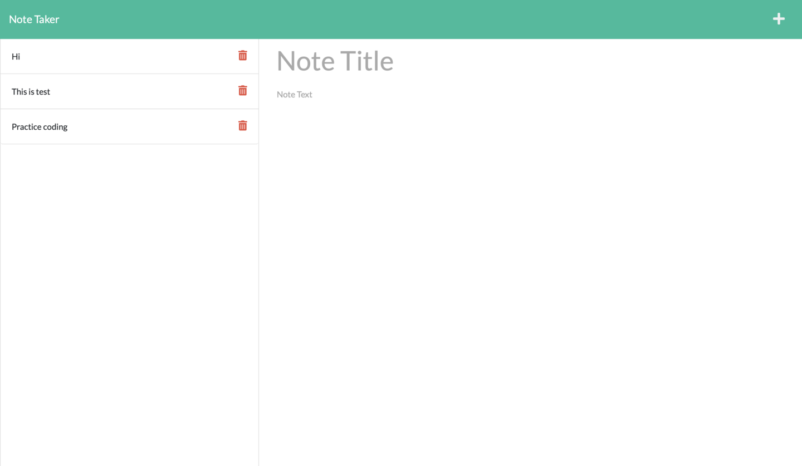
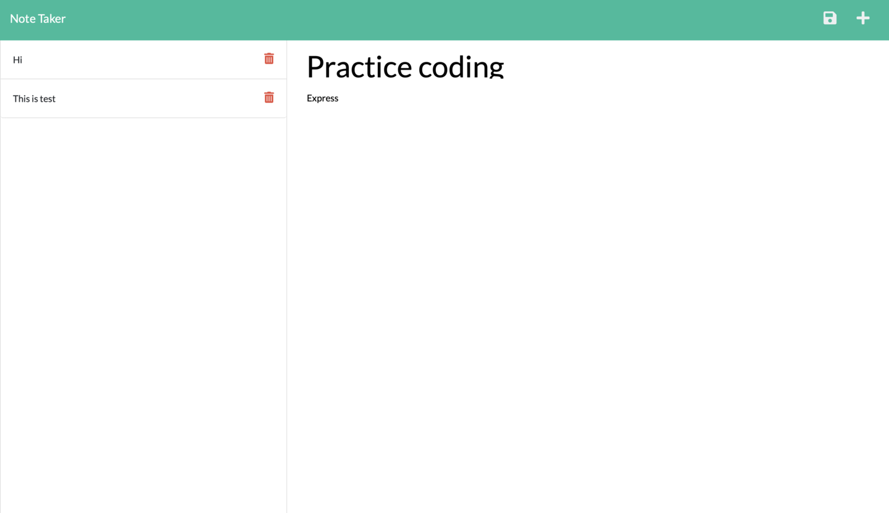

#  Express.js: Note Taker

## Description

 This is an simple application called Note Taker that can be used to write and save notes. This application has builted up with an Express.js back end it can save and retrieve note data from a JSON file. This app will run in the browser and feature dynamically with updated [HTML](https://developer.mozilla.org/en-US/docs/Web/HTML), [CSS](https://developer.mozilla.org/en-US/docs/Web/CSS), [javascript](https://developer.mozilla.org/en-US/docs/Web/JavaScript), [Node.js](https://nodejs.org/en/), and [Express](https://www.npmjs.com/package/express). 


## Features:

```
This app sets up Express routing and uses a JSON file for CRUD interactions.
For the conveninet, and best visual experinece, it has made simple, 
responsive, and colorful with appropriate css style .
```

## Deployed Heroku Link:
 ### [Note Taker App](https://rajesh295-dev.github.io/updated-portfolio/)


 
 


## Screenshots:

    

  
## Links :

* Link for the deployed application [Note-Taker ]()
* Link for the Github repository [Host by Github](https://github.com/Rajesh295-dev/note-Taker)


## Contributor:

* [Rajesh Gautam](https://github.com/Rajesh295-dev)

- - -
